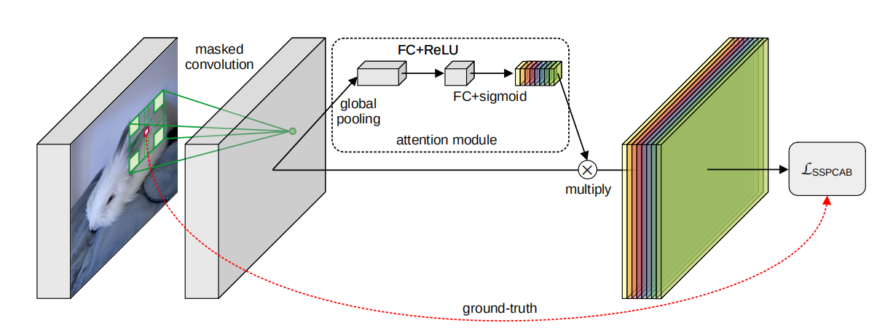

# SSPCAB-paddle

## 目录

- [1. 简介]()
- [2. 数据集和复现精度]()
- [3. 准备数据与环境]()
    - [3.1 准备环境]()
    - [3.2 准备数据]()
    - [3.3 准备模型]()
- [4. 开始使用]()
    - [4.1 模型训练]()
    - [4.2 模型评估]()
    - [4.3 模型预测]()
- [5. 模型推理部署]()
- [6. 自动化测试脚本]()
- [7. LICENSE]()
- [8. 参考链接与文献]()

## 1. 简介
本项目基于paddlepaddle对SSPCAB-CutPatse(3-way)进行了复现。  
SSPCAB是一个基于重建损失的预测体系模块，模块包括一个扩张卷积层和一个通道注意力模块，结构如下图所示。

SSPCAB模块可以广泛应用到各类卷积网络中，只需简单地将模块替换原有网络的某一层卷积层并添加一个损失值，即可带来性能的提升。  
CutPaste是一种简单有效的自监督学习方法，其目标是构建一个高性能的两阶段缺陷检测模型，在没有异常数据的情况下检测图像的未知异常模式。首先通过cutpaste数据增强方法学习自监督深度表示，然后在学习的表示上构建生成的单类分类器，从而实现自监督的异常检测。

**论文:** [Self-Supervised Predictive Convolutional Attentive Block for Anomaly Detection](https://arxiv.org/pdf/2111.09099.pdf)
**参考repo:** [sspcab](https://github.com/ristea/sspcab)

**论文:** [CutPaste: Self-Supervised Learning for Anomaly Detection and Localization](https://https://arxiv.org/pdf/2111.09099.pdf)
**参考repo:** [pytorch-cutpaste](https://github.com/Runinho/pytorch-cutpaste)

在此非常感谢`ristea`等人贡献的[sspcab](https://github.com/ristea/sspcab) 和`Runinho`等人贡献的[pytorch-cutpaste](https://github.com/Runinho/pytorch-cutpaste) 提高了本repo复现论文的效率。

**aistudio体验教程:** [sspcab_paddle](https://aistudio.baidu.com/aistudio/projectdetail/4390409)


## 2. 数据集和复现精度

- 数据集大小：共包含15个物品类别，解压后总大小在4.92G左右
- 数据集下载链接：[mvtec-ad](https://www.mvtec.com/company/research/datasets/mvtec-ad/)
- 训练权重下载链接：[logs](https://pan.baidu.com/s/1yKPp8gxZV8_s-OcvOsICiw ) 提取码：xa5d
# 复现精度（Comparison to Ristea.）
| defect_type   |   CutPaste(3-way)+SSPCAB(本项目) |  Ristea. CutPaste(3-way)+SSPCAB | Li et al. CutPaste (3-way) |
|:--------------|--------------------:|-------------------:|-----------------------------:|
| bottle        |                99.4 |               98.6 |                         98.3 |
| cable         |                89.5 |               82.9 |                         80.6 |
| capsule       |                92.9 |               98.1 |                         96.2 |
| carpet        |                96.4 |               90.7 |                         93.1 |
| grid          |                99.9 |               99.9 |                         99.9 |
| hazelnut      |                99.3 |               98.3 |                         97.3 |
| leather       |               100.0 |              100.0 |                        100.0 |
| metal_nut     |                98.8 |              100.0 |                         99.3 |
| pill          |                94.2 |               95.3 |                         92.4 |
| screw         |                88.5 |               90.8 |                         86.3 |
| tile          |                98.8 |               94.0 |                         93.4 |
| toothbrush    |               100.0 |               98.8 |                         98.3 |
| transistor    |                97.5 |               96.5 |                         95.5 |
| wood          |                99.7 |               99.2 |                         98.6 |
| zipper        |               100.0 |               98.1 |                         99.4 |
| average       |                96.9 |               96.1 |                         95.2 |


## 3. 准备数据与环境


### 3.1 准备环境

首先介绍下支持的硬件和框架版本等环境的要求：

- 硬件：GPU显存建议在6G以上
- 框架：
  - PaddlePaddle >= 2.2.0
- 环境配置：直接使用`pip install -r requirements.txt`安装依赖即可。

### 3.2 准备数据

- 全量数据训练：
  - 下载好 [metec-ad](https://www.mvtec.com/company/research/datasets/mvtec-ad/) 数据集
  - 将其解压到 **Data** 文件夹下
- 少量数据训练：
  - 无需下载数据集，使用lite_data里的数据即可


### 3.3 准备模型

- 默认不使用resnet18预训练模型进行训练，如想使用,需要预先下载[预训练权重](https://pan.baidu.com/s/1QJkda31WcaY9ngALvWsGDw 
) (提取码：l7c3)至项目根目录下并传入参数：`python train.py --pretrained_resnet True`

## 4. 开始使用


### 4.1 模型训练

- 全量数据训练：
  - 下载好 [metec-ad](https://www.mvtec.com/company/research/datasets/mvtec-ad/) 数据集后，将其解压到 **Data** 文件夹下
  - 运行指令`python tools/train.py --epochs 10000 --batch_size 32 --workers 4 --log_interval 10 --test_epochs 50`
- 少量数据训练：
  - 运行指令`python tools/train.py --data_dir lite_data --type lite --epochs 5 --batch_size 4`
- 部分训练日志如下所示：
```
> python tools/train.py --data_dir lite_data --type lite --epochs 5 --batch_size 4 --cuda False 
Namespace(batch_size=4, cuda='False', data_dir='lite_data', epochs=5, freeze_resnet=20, head_layer=1, lr=0.03, model_dir='logs', optim='sgd', pretrained=False, save_interval=500, test_epochs=-1, type='l
ite', variant='3way', workers=0)
using device: cpu
training bottle
loading images
loaded 209 images
epoch:1/5 loss:1.5029 acc:0.000 avg_reader_cost:0.047 avg_batch_cost:2.999 avg_ips:0.750 lr:0.030000
epoch:2/5 loss:2.1899 acc:0.000 avg_reader_cost:0.023 avg_batch_cost:2.837 avg_ips:0.709 lr:0.030000
epoch:3/5 loss:1.5283 acc:0.000 avg_reader_cost:0.021 avg_batch_cost:2.771 avg_ips:0.693 lr:0.030000
...
``` 


### 4.2 模型评估

- 全量数据模型评估：`python eval.py`
- 少量数据模型评估：`python tools/eval.py --data_dir lite_data --type lite --cuda False`
```
> python tools/eval.py --data_dir lite_data --type lite --cuda False
Namespace(cuda='False', data_dir='lite_data', density='sklearn', head_layer=1, model_dir='logs', save_plots=True, type='lite')
evaluating bottle
loading model logs/bottle/final.pdparams
loading images
using density estimation GaussianDensitySklearn
bottle AUC: 0.875
average auroc:0.8750
``` 

### 4.3 模型预测（需要预先完成4.1训练及4.2验证）

- 基于原始代码的模型预测：`python tools/predict.py --data_type bottle --img-path images/demo0.png --dist_th 1.1`
- 基于推理引擎的模型预测：
```
python deploy/export_model.py
python deploy/infer.py --data_type bottle --img-path images/demo0.png --dist_th 1.1
```
部分结果如下：
```
> python deploy/export_model.py
inference model has been saved into deploy

> python deploy/infer.py --data_type bottle --img-path images/demo0.png --dist_th 1.1
image_name: images/demo0.png, class_id: 0, prob: 0.07689752858017344
``` 


## 5. 模型推理部署

模型推理部署详见4.3节-基于推理引擎的模型预测。


## 6. 自动化测试脚本

[tipc创建及基本使用方法。](https://github.com/PaddlePaddle/models/blob/release/2.2/tutorials/tipc/train_infer_python/test_train_infer_python.md)


## 7. LICENSE

本项目的发布受[Apache 2.0 license](./LICENSE)许可认证。

## 8. 参考链接与文献
**论文:** [CutPaste: Self-Supervised Learning for Anomaly Detection and Localization](https://https://arxiv.org/pdf/2111.09099.pdf)
**参考repo:** [pytorch-cutpaste](https://github.com/Runinho/pytorch-cutpaste)

**论文:** [Self-Supervised Predictive Convolutional Attentive Block for Anomaly Detection](https://arxiv.org/pdf/2111.09099.pdf)
**参考repo:** [sspcab](https://github.com/ristea/sspcab)
